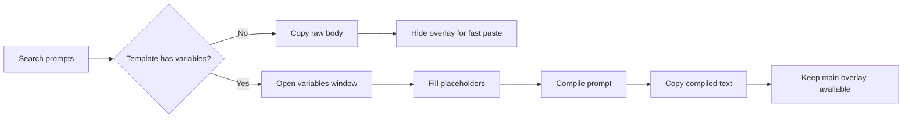
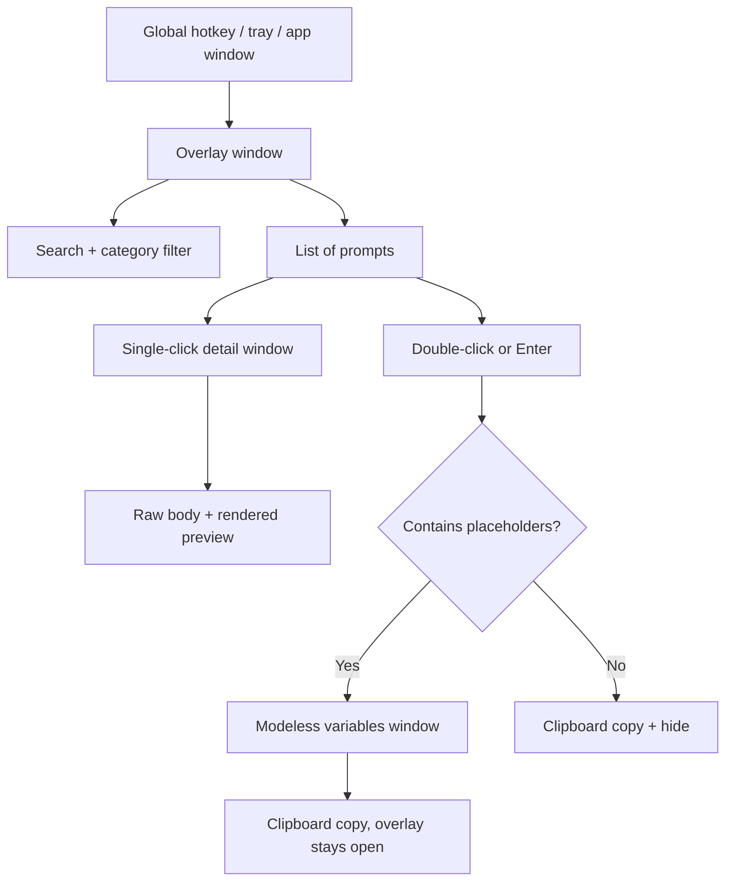
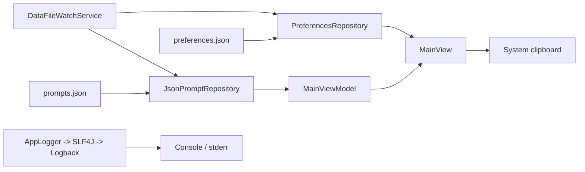

# Prompt Butler

[](https://openjdk.org/)
[](https://openjfx.io/)
[](https://gradle.org/)
[](https://junit.org/junit5/)


**Prompt Butler** is a small **JavaFX** desktop utility for **developers, writers, and power users** who reuse text snippets and **LLM / chat prompts**. It stays on top of your screen as a **lightweight overlay**: **search** fuzzy-matched **prompt templates**, fill **`{{placeholders}}`**, and **copy** the result to the system clipboard—without hunting through files or browser tabs. A **global hotkey** (Ctrl+Alt+P on Windows/Linux, Cmd+Alt+P on macOS) shows or hides the window quickly.

Templates are stored as **JSON** on disk (with optional **import/export**), UUID-based ids, and a **configurable data folder** so you can keep prompts next to projects or in a shared drive.

For **developers** (architecture, packages, build internals, extension points), see **[`TECHNICAL.md`](TECHNICAL.md)**. For narrative / checkpoint-style project state (including UFT/Java agent notes), see **[`PROJECT_STATE_CHECKPOINT.md`](PROJECT_STATE_CHECKPOINT.md)**. Release history is in **[`CHANGELOG.md`](CHANGELOG.md)**.

---

**Version:** `0.4.3` (see `build.gradle` → `version`).

## Table of contents

- [Technical reference (developers)](#technical-reference-developers)
- [What you can do with Prompt Butler](#what-you-can-do-with-prompt-butler)
- [How to use](#how-to-use)
- [Quick start (run from source)](#quick-start-run-from-source)
- [Build from source](#build-from-source)
- [Tests and coverage](#tests-and-coverage)
- [Publishing and distribution](#publishing-and-distribution)
- [Configuration and data files](#configuration-and-data-files)
- [License](#license)
- [Troubleshooting](#troubleshooting)

---

## What you can do with Prompt Butler

| Capability | Description |
|------------|-------------|
| **Fuzzy search** | Tiered matching over title/tags/body (prefix/contains first, fuzzy fallback). |
| **Favorites** | Star templates to pin them at the top of search results (★). |
| **Variables** | Templates support `{{name}}` placeholders; fill a small form, then copy compiled text. |
| **Clipboard** | One-click or keyboard copy of prompt body or compiled output. |
| **Import / export** | JSON library for backup, sharing, or migration (import reassigns UUID ids). |
| **Categories** | Assign categories, filter by category, create/delete categories in dialogs (delete reassigns to **General**). |
| **Usage + revisions** | Tracks usage count, last-used timestamp, and bounded body revision history. |
| **Tray & auto-hide** | Optional system tray and defocus/minimize behaviors (see `preferences.json`). |
| **Dark mode** | Toggle dark theme via `preferences.json` (`"darkMode": true`). |
| **Theme-aware icons** | Icon glyph colors adapt per theme (white in dark mode for better contrast). |
| **Configurable hotkey** | Override the global toggle shortcut in `preferences.json` (`hotkeyKeyCode`, `hotkeyModifiers`). |
| **Data folder** | Toolbar **Data Folder** sets where `prompts.json` / `preferences.json` live (pointer under `~/PromptButler/`; restart to apply). |
| **Live reload** | `prompts.json` / `preferences.json` updates are watched and reloaded at runtime. |
| **Markdown preview** | Prompt details show raw body + rendered preview side by side, and the editor now includes a live WebView preview with Unicode, platform emoji font fallback, tables, task lists, code fences, and Mermaid-ready rendering. |



---

## How to use

### 1. Open the overlay

- Press **Ctrl+Alt+P** (Windows/Linux) or **Cmd+Alt+P** (macOS), **or** use the tray icon if you enabled tray auto-hide in `preferences.json`.
- The window is an **always-on-top** card: **Prompt Butler** title strip, search box, list of prompts, toolbar at the bottom.
- **Move the window:** drag anywhere on the **Prompt Butler** title strip at the top (there is no native title bar because the overlay uses a transparent frame).

### 2. Find a prompt

- Type in the **search** box; ranking prioritizes prefix/contains hits, includes body text matches, and falls back to bounded fuzzy scoring.
- Use the **Category** dropdown beside search to filter templates.
- Use **↑** / **↓** while the **list** is focused to move the selection (click the list first if focus is in the search field).

### 3. Copy without opening the variable form

| Goal | What to do |
|------|------------|
| Copy the **raw template body** (placeholders **not** filled) | Click the **Copy** icon on the row, **or** select the row and press **Ctrl+C** (list focused, not the search field). The overlay stays open; a short “Copied” status appears. |
| Open read-only **details** (id, body, rendered preview, actions) | **Single-click** the row (not on the row’s Copy icon). A modal opens with prompt metadata plus a split raw/preview view and actions like **Copy**, **Edit**, **Delete**, **Close**. |

### 4. Use a prompt with `{{variables}}` (separate window)

Templates can include placeholders like `{{language}}` or `{{role}}` in the **`body`** (names: letters, digits, `_`, `-` only).

**Example** (similar to the bundled *Refactor assistant* template):

```text
Act as an expert {{language}} developer and refactor the following code with {{style}} conventions:

{{code_block}}
```

**Steps:**

1. **Double-click** the prompt in the list, **or** select it and press **Enter** (with list focus, not inside the search field).
2. A **separate modeless window** opens: one **text field per variable** (`language`, `style`, `code_block` in the example above). The **main overlay stays visible** so you can search and browse prompts while the form is open.
3. Fill the fields. Press **Ctrl+Enter** (Windows/Linux) or **Cmd+Enter** (macOS) to jump to the next field; on the **last** field this acts like **Copy & close**.
4. Click **Copy & close** to put the **fully expanded** text on the clipboard and close the variables window (**the main overlay stays open**), **or** **Copy — keep open** to copy and leave the variables window open.
5. Paste into your editor, browser, or chat. Press **Escape** while the variables window is focused to close it without copying; **Escape** on the main overlay still hides the overlay when the variables window is not open.

### 5. Use a prompt with **no** variables (fast paste)

If the body has **no** `{{placeholders}}`:

1. **Double-click** or **Enter** on the row.
2. The **raw body** is copied and the overlay **hides** automatically (after a short internal delay so the gesture finishes safely).

### 6. Toolbar actions

| Button | Use it to… |
|--------|------------|
| **New** | Create a template (title, body, tags, category). Category is selected from a dropdown and supports **New Category** popup creation, and the body editor includes a live markdown preview tab. |
| **Shortcuts** | Show keyboard shortcut help (**F1**). |
| **Import** | Replace the whole library from a JSON file (ids are reassigned on import). Drag-and-drop `.json` import is supported. |
| **Export** | Export selected templates, or all templates if none are selected. |
| **Settings** | Configure dark mode, auto-hide mode, compile quoting, default category, and delete categories (prompts move to **General**). |
| **Data** | Change where `prompts.json` / `preferences.json` are stored (writes a pointer under `~/PromptButler/`; **restart** to apply). |
| **Undo Delete** | Restore the most recently deleted prompt. |
| **Quit** | Exit the application. |

**Note:** Opening Settings and in-app dialogs no longer triggers tray auto-hide while those windows are active.

### 6.1 UI flow at a glance



### 7. Example: add your own snippet via JSON

After running once, edit **`prompts.json`** in your [data directory](#configuration-and-data-files) (or use **New** in the UI). Each template looks like:

```json
{
  "id": "f47ac10b-58cc-4372-a567-0e02b2c3d479",
  "title": "Commit message",
  "body": "Write a concise Git commit message for the following diff.\n\nRepository context: {{repo}}\n\nDiff:\n{{diff}}",
  "tags": ["git", "commit"]
}
```

Use a **new UUID** for `id` when adding by hand (or use **New** in the app so the id is generated for you). The app now watches `prompts.json` and reloads changes at runtime.

---

## Quick start (run from source)

**Requirements:** **JDK 17+** and network access for the first Gradle sync (OpenJFX and other dependencies resolve from Maven Central).

Clone the repository, then from the project root:

```bash
# Windows (PowerShell or cmd)
.\gradlew.bat run

# macOS / Linux
./gradlew run
```

**Profiles**

| Command | When to use |
|---------|-------------|
| `./gradlew run` | Default **prod**-style run (`prompt.butler.profile=prod`). |
| `./gradlew run -Penv=dev` | Verbose logging, dev overlay border, seeds from `dev-prompts.json` when the store is empty. |
| `./gradlew runDebugVisibleLogs` | Dedicated debug task that forces the dev profile and keeps app logs attached to the console. |
| `./gradlew run -PkeepUftJvmHooks=true` | Rare: keep Micro Focus **UFT** JVM hooks on the **application** process (often breaks JavaFX; default is to strip `JAVA_TOOL_OPTIONS` / `_JAVA_OPTIONS` for the child JVM only). |

You may still see “Picked up JAVA_TOOL_OPTIONS” from the **Gradle** JVM; that is usually harmless. The app process is forked **without** those variables unless you pass `-PkeepUftJvmHooks=true`.

### Debug mode with visible logs

For the simplest debug-friendly run, start the app from Gradle with the **dev** profile:

```bash
# Windows
.\gradlew.bat run -Penv=dev

# macOS / Linux
./gradlew run -Penv=dev
```

Or use the dedicated Gradle task:

```bash
# Windows
.\gradlew.bat runDebugVisibleLogs

# macOS / Linux
./gradlew runDebugVisibleLogs
```

This keeps the application attached to the terminal, so **Logback** output remains visible while the UI is running. On Windows, prefer this over the generated `installDist` launcher when debugging, because the installed `.bat` script uses **`javaw`** and does not keep a console attached.

For IDE debugging, run `com.viruchith.PromptButler.PromptButlerApp` with these VM options:

```text
-Dprompt.butler.profile=dev
--add-exports=javafx.graphics/com.sun.glass.ui=ALL-UNNAMED
--add-opens=javafx.graphics/com.sun.glass.ui=ALL-UNNAMED
```

That gives you breakpoints, the dev profile, and visible console logs in the IDE run/debug console.

---

## Build from source

The repo includes the **Gradle Wrapper** (8.7); you do not need a global Gradle install.

```bash
./gradlew clean classes          # compile main + test classes
./gradlew jar                    # build library JAR (not a runnable fat JAR)
./gradlew installDist            # application distribution (recommended for local installs)
```

After **`installDist`**, scripts and runtime layout are under:

- **`build/install/prompt-butler/`** (name comes from `rootProject.name` in `settings.gradle`)
- **Windows:** `build\install\prompt-butler\bin\prompt-butler.bat` — launches with **`javaw`** and **`start ""`**, so the JVM does not attach a console and the `cmd` window from double-clicking can close right away while the app keeps running.
- **Unix / macOS:** `build/install/prompt-butler/bin/prompt-butler`

If you use **Micro Focus UFT** (or any tool that sets `JAVA_TOOL_OPTIONS` / `_JAVA_OPTIONS`), rebuild after pulling changes so the scripts clear those variables before Java starts. If the app still fails to start, see [Troubleshooting](#troubleshooting).

Copy that folder to another machine with the **same OS family** and a **JRE 17+** on `PATH`, or ship it inside an installer you create (see [Publishing](#publishing-and-distribution)).

---

## Tests and coverage

```bash
./gradlew test                   # unit tests
./gradlew check                  # tests + JaCoCo coverage gate on com.viruchith.PromptButler.core (≥ 80% lines)
./gradlew jacocoTestReport       # HTML + XML reports under build/reports/jacoco
```

---

## Publishing and distribution

There is **no** `jpackage` or `shadowJar` task in this repository by default. Practical options:

### 1. Install layout (`installDist`) — simplest

1. Run `./gradlew installDist` on the target **OS** (JavaFX native bits are platform-specific).
2. Zip **`build/install/prompt-butler/`** and attach it to a release, or copy the directory to users.
3. Ensure **JDK or JRE 17+** is installed and **`java`** is on `PATH` when using the generated scripts.

### 2. Fat JAR (cross-platform, single file)

Uses the [Shadow plugin](https://gradleup.com/shadow/) to produce one self-contained JAR with JavaFX natives for **Windows, macOS (Intel + Apple Silicon), and Linux** bundled inside. Java 17+ must be installed on the target machine, but no JavaFX installation or `--module-path` is needed.

**Build (any OS, JDK 17+ required on build machine):**

```bash
# macOS / Linux
./gradlew shadowJar

# Windows
.\gradlew.bat shadowJar
```

Output: `build/libs/prompt-butler-0.4.3-all.jar`

**Run on the target machine:**

```bash
# macOS / Linux
java --add-exports=javafx.graphics/com.sun.glass.ui=ALL-UNNAMED \
     --add-opens=javafx.graphics/com.sun.glass.ui=ALL-UNNAMED \
     -jar build/libs/prompt-butler-0.4.3-all.jar

# Windows (single line)
java --add-exports=javafx.graphics/com.sun.glass.ui=ALL-UNNAMED --add-opens=javafx.graphics/com.sun.glass.ui=ALL-UNNAMED -jar build\libs\prompt-butler-0.4.3-all.jar
```

> **Why the JVM flags?** `PromptButlerApp` accesses `com.sun.glass.ui` internals for the global hotkey and tray integration. These are the same flags already declared in `applicationDefaultJvmArgs` in `build.gradle` for the `run` and `installDist` paths.

### 3. Native installers (`jpackage`) — recommended for “real” releases

Oracle / OpenJDK **`jpackage`** can build `.msi`, `.dmg`, `.deb`, etc., from the `installDist` output or from modules. Typical steps (high level):

1. Produce a runtime with **`jlink`** that includes the `javafx.*` modules you use, **or** rely on a JDK that bundles JavaFX (rare on modern JDKs).
2. Run **`jpackage`** with `--input build/install/prompt-butler`, `--main-jar` / `--main-class`, and platform-specific options.
3. Sign binaries as required by your OS / app store pipeline.

Exact `jpackage` flags depend on your JDK vendor and CI image; add a `docs/packaging.md` or Gradle convention when you standardize this.

### 4. Maven Central / internal Artifactory

The Gradle **`maven-publish`** plugin is **not** configured here. To publish the library coordinates (`com.viruchith.promptbutler`), add `maven-publish`, signing, and your repository URL in `build.gradle`.

---

## Configuration and data files

| Mechanism | Purpose |
|-----------|---------|
| `PROMPT_BUTLER_DIR` or `-Dprompt.butler.dir=...` | Override data directory (highest precedence). |
| Toolbar **Data** | Choose JSON storage folder; writes `${user.home}/PromptButler/storage.json`; **restart** to apply. |
| Default (all platforms) | `${user.home}/PromptButler/` for `prompts.json` and `preferences.json`. |
| `preferences.json` | `autoHideMode`: `OPACITY`, `MINIMIZE`, `TRAY`, `HIDE`; `defocusOpacity` (0–1); `darkMode`; `hotkeyKeyCode` / `hotkeyModifiers`; `quoteCompiledVariables`; `defaultCategory`; `windowX`/`windowY`/`windowWidth`/`windowHeight`. |

**UI summary:** Row **Copy**; single-click opens a **detail** window (copy / favorite / edit / duplicate / delete). **New** creates prompts (UUID ids, category dropdown + category popup). **Import** replaces the library; drag/drop `.json` works. **Double-click** or **Enter** on the list runs the choose flow (variables or copy-and-hide). **Ctrl/Cmd+C** copies selected body when list is focused.
The main Category filter now applies immediately and remains selected until changed.
Prompt details now show the raw prompt body and rendered markdown preview together, and the editor preview tab reflects body changes live.

**Logging:** application logging is now backed by **SLF4J + Logback** via `src/main/resources/logback.xml`, while existing code continues to use the `AppLogger` facade.



---

## Technical reference (developers)

See **[TECHNICAL.md](TECHNICAL.md)** for package layout, startup sequence, JavaFX stage/scene decisions, `MainView` / `MainViewModel` responsibilities, JSON and schema flow, clipboard abstraction, hotkey and tray wiring, testing scope, and suggested extension points.

---

## Changelog

See **[`CHANGELOG.md`](CHANGELOG.md)** for release history.

---

## License

Prompt Butler is [free software](https://www.gnu.org/philosophy/free-sw.html) licensed under the **GNU General Public License v3.0** — see the [`LICENSE`](LICENSE) file.

Third-party runtime components (OpenJFX, Gson, jNativeHook, Ikonli, etc.) are listed with SPDX identifiers in [`NOTICE`](NOTICE). Compliance when **distributing** binaries is your responsibility (compatible licenses, attribution, and any GPL source-offer obligations for the combined work).

---

## Troubleshooting

- **Micro Focus UFT / `JAVA_TOOL_OPTIONS`:** The **`run`** task strips `JAVA_TOOL_OPTIONS` and `_JAVA_OPTIONS` from the **application** process (unless `-PkeepUftJvmHooks=true`). **`installDist`** rewrites **`prompt-butler.bat` / `prompt-butler`** so OpenJFX platform JARs are on **`--module-path`** with **`--add-modules`** (OpenJFX 11+ does not reliably start from a flat classpath alone), **`applicationDefaultJvmArgs`** Glass **`--add-exports` / `--add-opens`** apply there, and the scripts **clear** those env vars before **`java`**. Re-run **`./gradlew installDist`** after dependency or script changes. If hooks persist in your shell, clear them manually: `set JAVA_TOOL_OPTIONS=` and `set _JAVA_OPTIONS=` in `cmd` / PowerShell before starting the app.
- **Global hotkey (jnativehook):** Some corporate machines block low-level hooks; use the window and toolbar if registration fails (errors are logged).
- **Settings opens then app hides to tray:** Fixed in current builds. If you still see this, verify you are running **`0.4.0-SNAPSHOT`** or newer.
- **Window opens too small / buttons look compressed:** Fixed in current builds with content-aware minimum startup sizing.
- **Quit button / app won't exit:** The toolbar **Quit** and tray **Exit** both call `System.exit(0)` directly rather than `Platform.exit()`. On macOS, `Platform.exit()` deadlocks with AWT `SystemTray` (both compete for the AppKit lock). If you add a `Runtime.getRuntime().addShutdownHook` that calls `GlobalScreen.unregisterNativeHook()`, the JVM will hang on exit (including Ctrl+C); see `TECHNICAL.md §4.5`.
- **JavaFX / transparent window issues:** See **`PROJECT_STATE_CHECKPOINT.md`** for mitigations (deferred clipboard, click resolution, etc.).

---

## Repository layout (short)

- **`src/main/java/com/viruchith/PromptButler/`** — `PromptButlerApp`, `core/` (no JavaFX), `ui/`, `os/`
- **`src/main/resources/`** — default prompts, CSS, seeds, `appicon.png`
- **`build.gradle`** — Java 17 toolchain, OpenJFX 21, JaCoCo, `installDist` / `run`
- **`TECHNICAL.md`** — developer-oriented architecture and implementation notes
- **`LICENSE`** — GNU GPL v3.0; **`NOTICE`** — third-party library SPDX summary

---

*Prompt Butler — JavaFX prompt library, clipboard workflow, and global hotkey for faster writing and coding. Licensed under GPLv3.*
