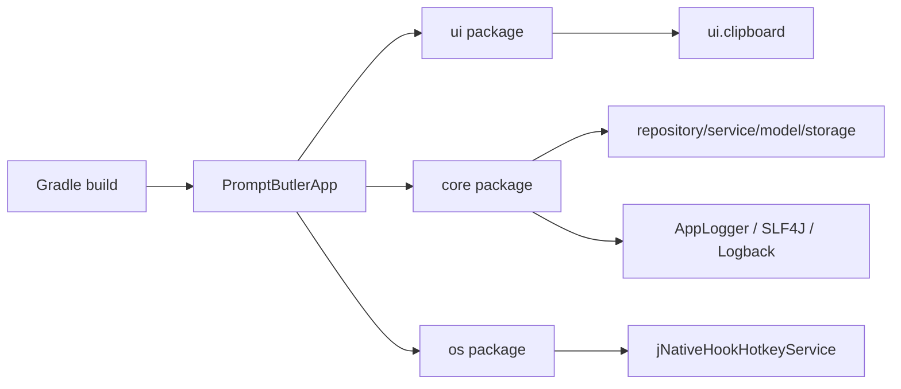
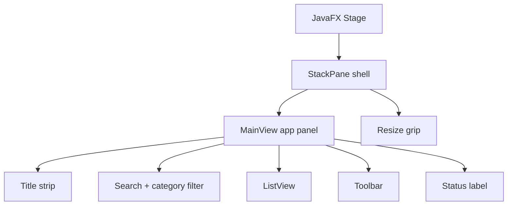
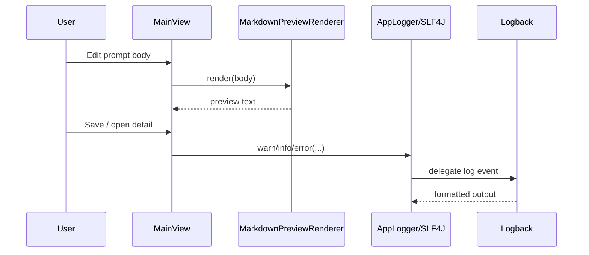

# Prompt Butler — technical reference

This document is for **developers** maintaining or extending the codebase. End-user usage remains in [README.md](README.md).

Current project version: **`0.4.3`**.

---

## 1. Copyright and license

- **Program:** Prompt Butler is released under the **GNU General Public License v3.0** (see [LICENSE](LICENSE)).
- **Contributions:** If you distribute modified versions, comply with GPLv3 (source offer, license notice, etc.).
- **Third-party components:** Runtime dependencies have their own licenses; see [NOTICE](NOTICE) for a summary and upstream URLs.

---

## 2. Technology stack

| Layer | Choice |
|-------|--------|
| Language | Java **17** (Gradle Java toolchain) |
| UI | **JavaFX 21** (OpenJFX via `org.openjfx.javafxplugin`) |
| Build | **Gradle 8.14.5** wrapper, `application` + `shadow` plugins |
| JSON | **Gson** 2.10.1 |
| Logging | **SLF4J 2.0** facade with **Logback 1.5** backend |
| Global hotkey | **jNativeHook** 2.2.2 (`com.github.kwhat:jnativehook`) |
| Icons (UI) | **Ikonli** Font Awesome 5 pack |
| Tests | **JUnit 5**, **Mockito**; **JaCoCo** on `core` tree (see `build.gradle`) |

**JavaFX modules** enabled in `build.gradle`: `javafx.controls`, `javafx.graphics` (sufficient for current UI; add `javafx.swing` only if you introduce Swing interop).

---

## 3. Repository layout (`src/main/java`)

| Package | Role |
|---------|------|
| `com.viruchith.PromptButler` | **`PromptButlerApp`** — `Application` entry, stage/scene wiring, lifecycle (`start` / `stop`), hotkey and tray bootstrap; **`Launcher`** — classpath-safe entrypoint used by fat JAR packaging |
| `...core.clipboard` | **`ClipboardPort`** abstraction; JavaFX adapter in `ui.clipboard` |
| `...core.logging` | **`AppLogger`** — compatibility facade over SLF4J/Logback; verbose info and stack traces still follow `BuildProfile` |
| `...core.model` | Immutable **`PromptTemplate`**, **`UserPreferences`**, **`BuildProfile`**, **`AutoHideMode`** |
| `...core.repository` | **`PromptRepository`** interface; **`JsonPromptRepository`** — Gson DTOs, file I/O, schema validation hook |
| `...core.service` | **FuzzySearchService**, **VariableParser**, **TemplateCompiler**, **JsonSchemaValidator**, **ImportExportService**, **RecoveryService**, **PreferencesRepository**, **DataFileWatchService** |
| `...core.storage` | **`StoragePaths`** — data directory resolution; **`SafePathResolver`** — prevents path escape when resolving children |
| `...core.util` | **`InputText`** — shared `trim` normalization for UI and model |
| `...os` | **`JNativeHookHotkeyService`** — low-level keyboard listener, maps to overlay toggle |
| `...ui` | **`MainView`**, **`MainViewModel`**, **`OverlayStageFactory`**, **`TrayIntegration`**, **`AutoHideController`**, **`UiIcons`**, dialogs and list chrome |

**Design rule:** `core` packages must **not** import JavaFX types, so domain and persistence stay testable without a UI toolkit on the classpath.

---

## 4. Application bootstrap (`PromptButlerApp`)

### 4.1 `start(Stage)`

1. **`Platform.setImplicitExit(false)`** — closing/hiding the main stage does **not** terminate the JVM; quit is explicit (toolbar **Quit**, tray **Exit**, or `Platform.exit()` from error paths).
2. **`BuildProfile.current()`** — reads `prompt.butler.profile` (`dev` vs default `prod`): toggles verbose logging behavior and dev-only resources.
3. Delegates to **`startApplication`** inside try/catch; fatal errors show a JavaFX `Alert` then `Platform.exit()`.

### 4.2 Data directory and persistence

1. **`StoragePaths.resolveDataDirectory()`** — documented precedence in `StoragePaths` JavaDoc (env → system property → `~/PromptButler/storage.json` pointer → default `~/PromptButler`).
2. **`SafePathResolver`** — canonicalizes the base dir and resolves **only** known child filenames (`prompts.json`, `preferences.json`).
3. **`JsonPromptRepository`** — load/save; empty store triggers **seed** from classpath (`/dev-prompts.json` in dev, else `/default-prompts.json`), then first save.
4. **`RecoveryService`** — used when the on-disk JSON is invalid; attempts repair using backup / defaults (see class and tests).

### 4.3 Stage and scene graph

1. **`OverlayStageFactory.applyOverlayChrome`** — `StageStyle.TRANSPARENT`, `alwaysOnTop`, optional dev opacity.
2. **`MainView`** — root content: title strip (icon + drag region), search, `ListView`, toolbar, status.
3. **`StackPane` shell** — holds `MainView` (top-left) and a small **south-east `Region`** used as a **resize grip** (mouse drag updates `stage` width/height with minimum bounds).
4. **`Scene`** — transparent fill (`OverlayStageFactory.applySceneBackgroundTransparent`) so rounded `app-panel` CSS shows correctly on the desktop.
5. **Stylesheets** — `/styles/overlay.css`, `overlay-dev.css`, or `overlay-dark.css` from classpath (theme is preference-driven at runtime). These now also style preview tabs and the split markdown/raw prompt view.
6. **`stage.setOnCloseRequest`** — **consumes** the default close action and **hides** the stage (overlay pattern, not process exit).
7. **`loadApplicationIcon`** — adds `/appicon.png` to `stage.getIcons()` for taskbar / OS integration.
8. **Content-aware minimum size** — startup computes minimum stage dimensions from `MainView` preferred size so toolbar/action buttons are not compressed on small initial windows.

### 4.4 Auxiliary services

- **`TrayIntegration`** — AWT `SystemTray` + `TrayIcon`; menu **Open** / **Exit**; image from `/appicon.png` scaled for tray. **Exit** calls `System.exit(0)` directly.
- **`AutoHideController`** — listens to `stage.focusedProperty`; applies `UserPreferences.autoHideMode` (`OPACITY`, `MINIMIZE`, `TRAY`, `HIDE`) after a deferred FX pulse to let ownership/focus state settle, and includes a suspend guard for app-owned modal flows (Settings/dialogs). This avoids false auto-hide when focus transitions into owned child windows (for example variable-entry stage).
- **`JNativeHookHotkeyService`** — registers global key listener; hotkey handler **must** `Platform.runLater` when touching the Stage (native thread vs FX thread).
- **`DataFileWatchService`** — watches the data directory and triggers FX-thread reloads for `prompts.json` and `preferences.json`.
- **`stop()`** — unregisters hotkey listener and removes tray icon. Note: only reached if `Platform.exit()` is called (e.g. from error paths in `start()`); normal quit bypasses this via `System.exit(0)` (see §4.5).

### 4.5 Quit / exit strategy

`Platform.exit()` deadlocks on macOS when AWT `SystemTray` is active: both JavaFX (cleaning up the native Glass window) and AWT compete for the macOS AppKit lock. The workaround used throughout this codebase is to call **`System.exit(0)`** directly whenever the user explicitly quits:

- **Toolbar Quit button** (`MainView`) → `System.exit(0)`
- **Tray → Exit** (`TrayIntegration`) → `System.exit(0)`
- **Fatal startup error** (`PromptButlerApp.start`) → `Platform.exit()` (AWT tray is not yet installed; no deadlock risk)

`System.exit(0)` terminates all threads—including JNativeHook's non-daemon native event dispatch thread—without deadlocking. `Application.stop()` is still present for the `Platform.exit()` error path and performs the same listener/tray cleanup, but it is **not** called on the normal quit path.

> **Do not add a shutdown hook** that calls `GlobalScreen.unregisterNativeHook()`: that method blocks waiting for the native dispatch thread, which causes `System.exit(0)` (and even Ctrl+C) to hang.

---

### 5.1 `MainViewModel`

- Holds **`ObservableList<PromptTemplate>`** `masterList` (authoritative in-memory library) and **`filteredList`** (search results).
- **`searchText`** + `categoryFilter` properties drive `refreshFilter()`; query is normalized via `InputText`, category filtering is applied before ranking.
- **Mutations** — `addTemplate`, `deleteTemplate`, `replaceTemplateById`, `replaceAllTemplates` persist through **`PromptRepository`** and refresh the filter.
- **`variablesFor` / `compile`** — delegate to **`VariableParser`** and **`TemplateCompiler`** on template body placeholders.
- Category workflows include duplicate, restore-delete, and category deletion with reassignment to `General`.

### 5.2 `MainView` (behavior map)

| User action | Implementation notes |
|-------------|----------------------|
| **Title strip drag** | `installUndecoratedStageDrag` — no native title bar under `TRANSPARENT`; updates `stage.setX/Y` from screen mouse delta |
| **Title icon** | `ImageView` from `/appicon.png` |
| **Single-click row** (delayed) | `PauseTransition` ~320 ms; cancelled on double-click; opens **detail** `Stage` (`WINDOW_MODAL`) |
| **Detail preview** | Detail dialog now uses a `SplitPane` to keep **Prompt body** and **Rendered preview** visible together |
| **Double-click / Enter on list** | `onTemplateChosen` — no `{{vars}}` → clipboard + hide overlay with short `PauseTransition` delay (avoids Glass issues); with vars → **`openVariableParametersWindow`** (modeless `Stage`, `Modality.NONE`) |
| **Prompt editor preview** | New/Edit dialog uses a `TabPane` with **Write** and **Preview** tabs; preview is updated live from the body text area via `MarkdownPreviewRenderer` |
| **Variable window** | `commitVariables` closes variable stage then **`copyPlainTextThenMaybeHide(..., false)`** so main overlay stays visible; focus handoff to this owned modeless stage no longer triggers auto-hide side effects because defocus handling is deferred and re-checked |
| **Escape** | If variable window logic applies, close it; else **`hideOverlay()`** (hide stage, clear clipboard adapter retained buffers, close child stages) |
| **Import / Export** | `ImportExportService` + file choosers; import remaps UUIDs, export supports selected rows, drag/drop import supported |
| **Dialogs** | Theme stylesheet URL applied manually to `DialogPane` / `Alert` (dialogs do not inherit main scene CSS); Settings flow suspends auto-hide to avoid unintended tray hide |

### 5.3 Clipboard (`ClipboardPort` / `JavaFxClipboardAdapter`)

- **`copyPlainText`** writes to JavaFX `Clipboard`.
- **`clearRetainedSensitiveData`** — adapter-specific hygiene (not OS clipboard wipe); called from **`hideOverlay`**.

### 5.4 `OverlayStageFactory`

- Centralizes **transparent** stage style and **transparent scene fill** so all callers share the same overlay contract.

### 5.5 Markdown preview + logging

- **`MarkdownPreviewRenderer`** remains dependency-light and produces readable preview text for JavaFX controls rather than full HTML rendering.
- It now normalizes common markdown constructs including headings, emphasis, lists, blockquotes, links, images, fenced code blocks, and paragraph spacing.
- **`src/main/resources/logback.xml`** configures the current console logging backend.
- `AppLogger` remains the migration seam: call sites stay unchanged while Logback now controls formatting/output.

---

## 6. JSON schema and templates

- **`JsonSchemaValidator`** validates the **entire** prompt store JSON string before Gson parsing (max size guard, structural rules).
- **`PromptTemplate`** constructor **normalizes** id/title/body/tags via **`InputText`** (trim; blank tags dropped; blank id rejected).
- **Import** re-validates and assigns **new UUIDs** to every imported template to avoid collisions with the live library.
- `PromptTemplate` now supports `category`, `usageCount`, `lastUsedEpochMillis`, and bounded `revisions`.

---

## 7. Build, run, and profiles

| Command | Purpose |
|---------|---------|
| `./gradlew run` / `.\gradlew.bat run` | Run app; forks JVM with `prompt.butler.profile` default **prod** |
| `./gradlew run -Penv=dev` | Dev profile: verbose logs, dev CSS, dev seed when store empty |
| `./gradlew runDebugVisibleLogs` | Dedicated JavaExec task for debug sessions with dev profile and visible console logging |
| `./gradlew run -PkeepUftJvmHooks=true` | Rare: keep UFT-injected JVM hooks on app process (often breaks JavaFX) |
| `./gradlew test` / `check` | Unit tests + JaCoCo gate on `com.viruchith.PromptButler.core` |
| `./gradlew installDist` | Application distribution under `build/install/prompt-butler/` |
| `./gradlew shadowJar` | Cross-platform fat JAR → `build/libs/prompt-butler-*-all.jar`; bundles JavaFX natives for win / linux / mac / mac-aarch64; run with `java --add-exports=... --add-opens=... -jar` |

**`installDist` vs `./gradlew run`:** Gradle’s default **`installDist`** start scripts put everything on **`-classpath`**, which is **not** enough for OpenJFX 21: the JVM reports “JavaFX runtime components are missing”. **`build.gradle`** therefore patches **`startScripts`** so platform **`javafx-{base,graphics,controls}-*-(win|linux|mac|mac-aarch64).jar`** entries move to **`JAVAFX_MODULE_PATH`** and the **`java`** line gains **`--module-path "%JAVAFX_MODULE_PATH%"`** / **`--add-modules javafx.controls,javafx.graphics,javafx.base`** (Unix/Cygwin: same idea, plus **`cygpath`** for the module path). Other deps stay on **`-classpath`**. **`applicationDefaultJvmArgs`** Glass **`--add-exports` / `--add-opens`** are valid in that layout. The **`:run`** task still uses the JavaFX Gradle plugin’s module path; it only strips UFT-injected env vars on the app process. The generated scripts also **clear** **`JAVA_TOOL_OPTIONS`** / **`_JAVA_OPTIONS`** before launch when UFT injects agents that break Glass.

### 7.1 Debugging with visible logs

- **Recommended local debug run:** `.\gradlew.bat runDebugVisibleLogs` on Windows, or `./gradlew runDebugVisibleLogs` on Unix-like systems.
- This path keeps the app attached to the launching console and enables the **dev** profile, so `AppLogger` emits verbose messages through **SLF4J + Logback**.
- The `runDebugVisibleLogs` task is a dedicated `JavaExec` entry point that reuses the normal application JVM flags, forces `prompt.butler.profile=dev`, and strips UFT-injected environment hooks unless `-PkeepUftJvmHooks=true` is supplied.
- Avoid the generated Windows `installDist` launcher for debugging log output because it intentionally switches to **`javaw.exe`**, which detaches from the console.
- For an IDE launch configuration, run `com.viruchith.PromptButler.PromptButlerApp` with:
  - `-Dprompt.butler.profile=dev`
  - `--add-exports=javafx.graphics/com.sun.glass.ui=ALL-UNNAMED`
  - `--add-opens=javafx.graphics/com.sun.glass.ui=ALL-UNNAMED`
- Keep `src/main/resources/logback.xml` on the runtime classpath if you customize logger levels or formatting during debugging.

---

## 8. Testing strategy

- **Unit tests** live under `src/test/java` mirroring production packages.
- **JaCoCo** coverage verification (`check` task) is scoped in `build.gradle` **`afterEvaluate`** to **`core/**`** only — UI and OS integration are excluded from the **80% line** gate by design.
- **Mockito** is used where repositories or filesystem edges need isolation.

---

## 9. Extension points (suggested)

| Goal | Approach |
|------|----------|
| New storage backend | Implement **`PromptRepository`**; construct `MainViewModel` with it in `PromptButlerApp` |
| Different hotkey | Extend or replace **`JNativeHookHotkeyService`** mapping (`NativeKeyEvent` modifiers) |
| Packaged installers | Start from **`installDist`** output; use **`jpackage`** with a runtime image that includes required `javafx.*` modules (see README publishing section) |
| Theming | Extend `overlay.css` / `overlay-dev.css`; keep dialog stylesheet attachment in `MainView` in sync |
| Icon styling | `UiIcons` uses `app-icon-glyph`; set icon colors in CSS per theme (`overlay.css` / `overlay-dark.css`) |

---

## 10. Related files

| File | Contents |
|------|----------|
| [README.md](README.md) | User-facing features, quick start, troubleshooting |
| [PROJECT_STATE_CHECKPOINT.md](PROJECT_STATE_CHECKPOINT.md) | Historical / narrative project state (may lag code slightly) |
| [build.gradle](build.gradle) | Versions, JavaFX modules, JaCoCo scope, `run` task UFT workaround |
| [LICENSE](LICENSE) | GNU GPL version 3 full text |
| [NOTICE](NOTICE) | Third-party notices |

---

*Last updated to accompany GPLv3 licensing and in-repo developer documentation.*
